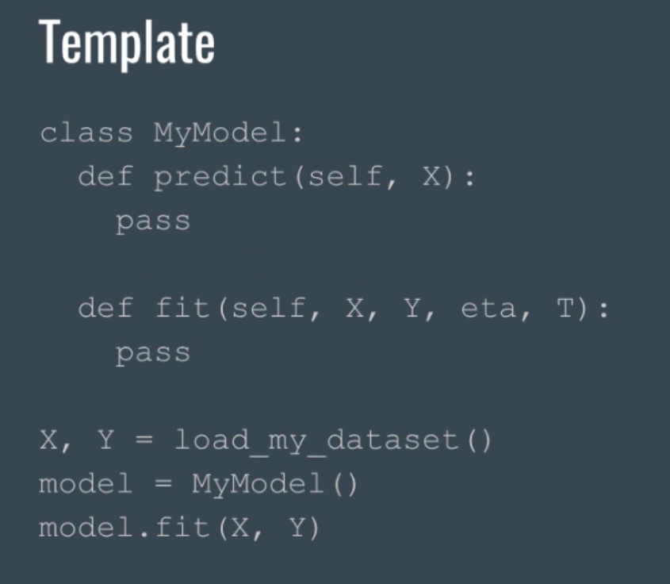

Appendix section 

# How to install tensorflow and other stuff already done 
modules needed 
* matplotlib 
* python3
* tensorflow 
* pandas 
* theno 

## how to succeed in this 
people sometimes assume that they know the things but they don't 
you have to make sure that you knew the prerequisite 

* we want to build the state of the art things 
* we want skills that are hard to get skills which will keep us in top 

### there is lot of material 
take your own notes and do some deriviation and math stff 
you will never gonna use the homemade app or homemade string class 
you are not implementing to be perfect you are doing it for learning 

# always from theory to code 

# how to code yourself 
* writing the code independently while doing the machine learning 
* you have to try to code all by yourself before going through the code 
* you have to practice things which you are learning 
* practicing the technique helps you to learn the techniques 
* when it's time to code you must code 
* you have to think all about the shapes and the variable datatypes of the datatypes which you have to work before doing operations 
* try to train model on various dataset learn something once and apply it to every industry 
* convert the data into x and y and fit it into our machine learning algorithm 
* filling what's in the fitting and the prediction 

# template of the code 

# test driven designs 
you have to write some test in order to make sure that the code is working 

# revisit the theory and use internet for finding more about the theory 

try to work with the python file structure and run it in the machine which you have or you can run the exact same code in jupyter notebook 

# how difficult the course is and where does it fits : 
this course requires some specific skillsets which you will need before starting this course 

- you have to know the python 
- you have to improve the python skills if you don't know what the instructor is saying 
- everything that you don't understand you have to learn that thing cause if you didn't you will never know what thing you have to do 

# this course is depends on what he wants to do or what do they have to learn if you don't have enough prerequisite you have to learn in then and then 
we have to cover all the math and the code in this course we mean really knowing the machine learning and not just programming with the api 
you have to do more coding in this course if you can't implement it and you didn't understand it so you have to do something which you are getting to understand that thing ! 

we are learning that how to use an algorithm in the particular dataset 
on experiencing the plugging and declaring the data what it is 